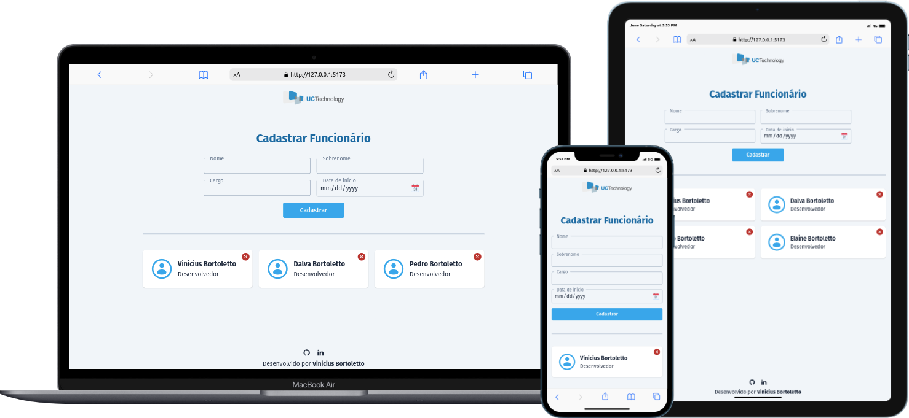
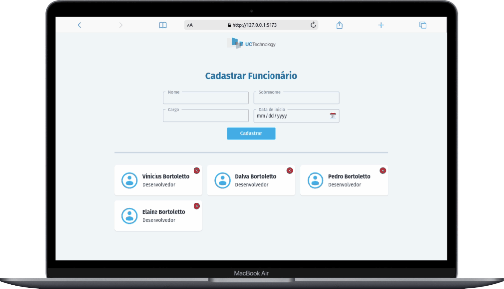

<div align="center">
  <h1>UC Technology Code Challenge</h1>
  Uma aplicação front-end onde você pode cadastar, visualizar funcionários, editar e remove funcionários. 
</div>

<hr />

<p align="center">
      
</p>

<p align="center">
  <a href="#writing_hand-sobre">Sobre</a>&nbsp;&nbsp;&nbsp;|&nbsp;&nbsp;&nbsp;
  <a href="#rocket-tecnologias">Tecnologias</a>&nbsp;&nbsp;&nbsp;|&nbsp;&nbsp;&nbsp;
  <a href="#information_source-como-usar">Como usar</a>&nbsp;&nbsp;&nbsp;|&nbsp;&nbsp;&nbsp;
  <a href="#video_camera-demo">Demo</a>
</p>

## :writing_hand: Sobre

Nesta aplicação, desenvolvida como um desafio para a empresa UC Technology, os usuários têm a possibilidade de cadastrar funcionários, fornecendo informações como nome completo, cargo e data de contratação. Além disso, a aplicação permite visualizar, editar ou remover os funcionários já cadastrados, utilizando uma API externa fornecida pela empresa.

A aplicação foi cuidadosamente projetada para ser responsiva, adaptando-se tanto a dispositivos desktop quanto a dispositivos móveis, garantindo uma experiência consistente em diferentes plataformas.

## :rocket: Tecnologias

Esse projeto foi desenvolvido usando as seguintes tecnologias:

- Vue.js
- Vue Router
- Axios
- ESLint
- Prettier
- TailwindCSS
- Iconify
- VS Code

## :information_source: Como usar

Para testar a aplicação, precisará das seguintes ferramentas:

- Git
- Node.js

<br />
<br />

Clone o repositório:

```bash
git clone https://github.com/vinibortoletto/uc-technology-code-challenge.git
```

Entre no diretório do projeto:

```bash
cd uc-technology-code-challenge
```

Instale as dependências:

```bash
npm install
```

Inicie a aplicação:

```bash
npm run dev
```

## :video_camera: Demo

<div>

### Cadastrando funcionário:


<br/>
<br/>

### Deletando funcionário:


<br/>
<br/>

### Editando funcionário:


<br/>
<br/>

</div>
