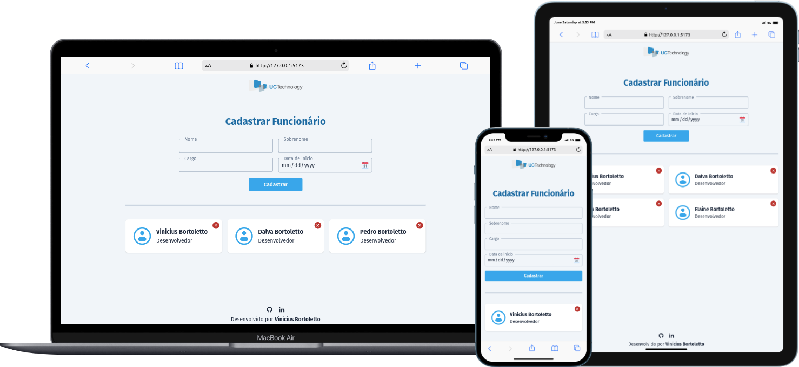
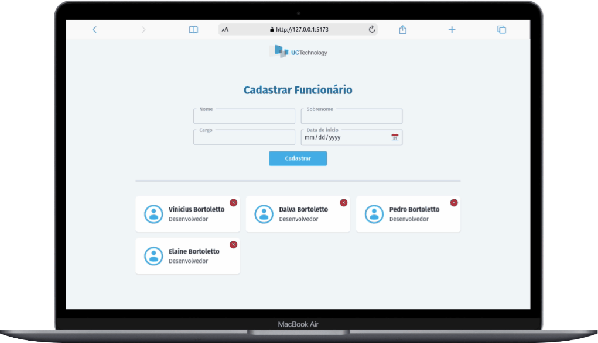

<div align="center">
  <h1>UC Technology Code Challenge</h1>
  Uma aplicação front-end onde você pode cadastar, visualizar funcionários, editar e remove funcionários. 
</div>

<hr />

<p align="center">
      
</p>

<p align="center">
  <a href="#writing_hand-sobre">Sobre</a>&nbsp;&nbsp;&nbsp;|&nbsp;&nbsp;&nbsp;
  <a href="#rocket-tecnologias">Tecnologias</a>&nbsp;&nbsp;&nbsp;|&nbsp;&nbsp;&nbsp;
  <a href="#information_source-como-usar">Como usar</a>&nbsp;&nbsp;&nbsp;|&nbsp;&nbsp;&nbsp;
  <a href="#video_camera-demo">Demo</a>
</p>

## :writing_hand: Sobre

Nesta aplicação, criada como desafio para a empresa UC Technology, o usuário pode cadastrar funcionários, adicionando seu nome completo, cargo e data de contratação. Além disso, também é possível visualizar os funcionários já cadastrados, assim como editá-los ou removê-los, sempre usando um API externa (providênciada pela empresa).

A aplicação foi desenvolvida de responsiva, podendo ser visualizada por desktop ou aparelhos mobile.

## :rocket: Tecnologias

Esse projeto foi desenvolvido usando as seguintes tecnologias:

- Vue.js
- Vue Router
- Axios
- ESLint
- Prettier
- TailwindCSS
- Iconify
- VS Code

## :information_source: Como usar

Para testar a aplicação, precisará das seguintes ferramentas:

- Git
- Node.js

```bash
# Clone o repositório:
git clone https://github.com/vinibortoletto/uc-technology-code-challenge.git

# Entra no diretório do projeto:
cd uc-technology-code-challenge/app

# Instale as dependências:
npm install

# Inicie a aplicação:
npm run dev
```

## :video_camera: Demo

<div>

### Cadastrando funcionário:


<br/>
<br/>

### Deletando funcionário:


<br/>
<br/>

### Editando funcionário:


<br/>
<br/>

</div>

<br/><br/>

<br/><br/>

<p align="center">
  Criado e desenvolvido por <b>Vinicius Bortoletto</b>
  <br/><br/>
  
  <a href="https://vinibortoletto.vercel.app/">
    
  </a>
  &nbsp;&nbsp;
  <a href="https://www.linkedin.com/in/vinicius-bortoletto/">
    
  </a>
</p>
